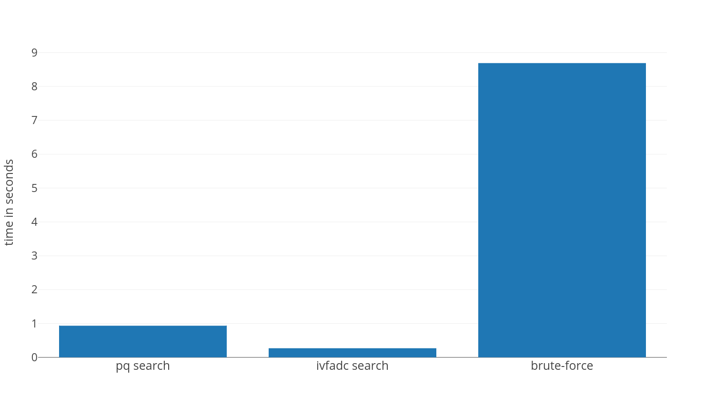
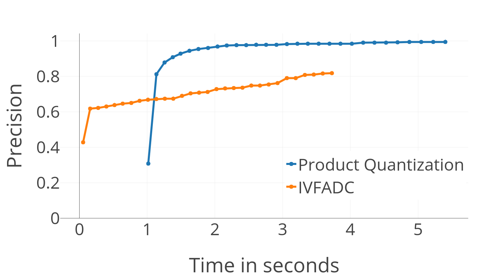
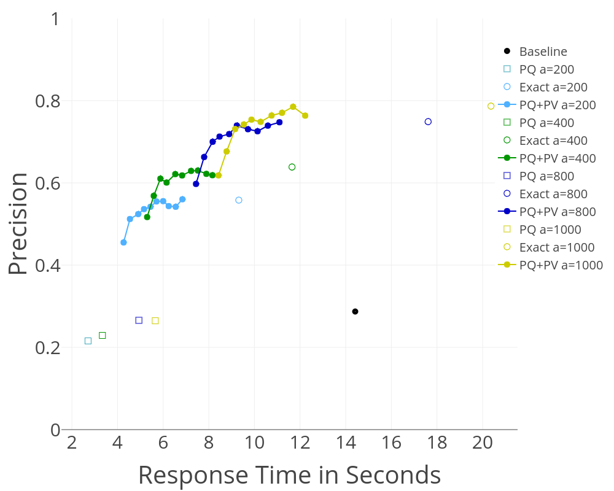

#  FREDDY: Fast Word Embeddings in Database Systems

FREDDY is a system based on Postgres which is able to use word embeddings exhibit the rich information encoded in textual values. Database systems often contain a lot of textual values which express a lot of latent semantic information which can not be exploited by standard SQL queries. We developed a Postgres extension which provides UDFs for word embedding operations to compare textual values according to there syntactic and semantic meaning.      

## Word Embedding operations

### Similarity Queries
```
cosine_similarity(float[], float[])
```
**Example**
```
SELECT keyword
FROM keywords AS k
INNER JOIN word_embeddings AS v ON k.keyword = v.word
INNER JOIN word_embeddings AS w ON w.word = 'comedy'
ORDER BY cosine_similarity(w.vector, v.vector) DESC;
```

### Analogy Queries
```
analogy(varchar, varchar, varchar)
```
**Example**
```
SELECT *
FROM analogy('Francis_Ford_Coppola', 'Godfather', 'Christopher_Nolan');

```
### K Nearest Neighbour Queries

```
k_nearest_neighbour_ivfadc(float[], int)
k_nearest_neighbour_ivfadc(varchar, int)
```
**Example**
```
SELECT m.title, t.word, t.squaredistance
FROM movies AS m, k_nearest_neighbour_ivfadc(m.title, 3) AS t
ORDER BY m.title ASC, t.squaredistance DESC;
```

### K Nearest Neighbour Queries with Specific Output Set

```
knn_in_pq(varchar, int, varchar[]);
```
**Example**
```
SELECT * FROM
knn_in_pq('Godfather', 5, ARRAY(SELECT title FROM movies));
```

### K Nearest Neighbour Join Queries

```
knn_join(varchar[], int, varchar[]);
```
**Example**
```
SELECT *
FROM knn_join(ARRAY(SELECT title FROM movies), 5, ARRAY(SELECT title FROM movies));
```

### Grouping

```
groups(varchar[], varchar[])
```
**Example**
```
SELECT *
FROM groups(ARRAY(SELECT title FROM movies), '{Europe,America}');
```

## Indexes

We implemented several index structures to accelerate word embedding operations. One index is based on [product quantization](http://ieeexplore.ieee.org/abstract/document/5432202/) and one on IVFADC (inverted file system with asymmetric distance calculation). Product quantization provides a fast approximated distance calculation. IVFADC is even faster and provides a non-exhaustive approach which also uses product quantization.
In addition to that, an inverted product quantization index for kNN-Join operations can be created.

<!--  -->

### Post verification

The results of kNN queries could be improved by using post verification. The idea behind this is to obtain a larger result set with an approximated kNN search (more than k results) and run an exact search on the results afterwards.

To use post verification within a search process, use `k_nearest_neighbour_pq_pv` and `k_nearest_neighbour_ivfadc_pv`.

**Example**
```
SELECT m.title, t.word, t.squaredistance
FROM movies AS m, k_nearest_neighbour_ivfadc_pv(m.title, 3, 500) AS t
ORDER BY m.title ASC, t.squaredistance DESC;
```

The effect of post verification on the response time and the precision of the results is shown below.



### Parameters of the kNN-Join operation
Precision and execution time of the kNN-Join operation depend on the parameters `alpha` and `pvf`.
The selectivity `alpha` determine the factor of pre-filtering. Higher values correspond to higher execution time and higher precision.
The kNN-Join can also use post verification which is configurable by the post verification factor `pvf`.
To enable post verification one has to set the method flag (0: approximated distance calculation; 1: exact distance calculation; 2: post verification)
This can be done as follows:
```
SELECT set_method_flag(2);
```
The parameters `alpha` and `pvf` can be set in a similar way:
```
SELECT set_pvf(20);
SELECT set_alpha(100);
```

### Evaluation of PQ and IVFADC
| Method                           | Response Time | Precision     |
| ---------------------------------| ------------- | ------------- |
| Exact Search                     | 8.79s         | 1.0           |
| Product Quantization             | 1.06s         | 0.38          |
| IVFADC                           | 0.03s         | 0.35          |
| IVFADC (batchwise)               | 0.01s         | 0.35          |
| Product Quantization (postverif.)| 1.29s         | 0.87          |
| IVFADC (postverif.)              | 0.26s         | 0.65          |

**Parameters:**
* Number of subvectors per vector: 12
* Number of centroids for fine quantization (PQ and IVFADC): 1024
* Number of centroids for coarse quantization: 1000

### Evaluation of kNN-Join
An Evaluation of the kNN-Join performance you can see here. The baseline in the diagram is a kNN-Join based on product quantization search which is implemented in the `pq_search_in_batch` function.
The measurements are done with different alpha values and different post verification factors (pvf).
Every color encodes a different alpha value.
The different symbols encode the different distance calculation methods.
For the post verifiction measurements are done with different values of pvf.

 

 **Parameters:**  
 Query Vector Size: 5,000  
 Target Vector Size: 100,000  
 K: 5  
 PVF-Values: 10, 20, ..., 100  

## Setup
At first, you need to set up a [Postgres server](https://www.postgresql.org/). You have to install [faiss](https://github.com/facebookresearch/faiss) and a few other python libraries to run the import scripts.

To build the extension you need to install the postgresql-server-dev package over the package manager first. Then, you can switch to the "freddy_extension" folder. Here you can run `sudo make install` to build the shared library and install the extension into the Postgres server. Hereafter you can add the extension in PSQL by running `CREATE EXTENSION freddy;`

## Index creation
To use the extension you have to provide word embeddings. The recommendation here is the [word2vec dataset from google news](https://drive.google.com/file/d/0B7XkCwpI5KDYNlNUTTlSS21pQmM/edit?usp=sharing). The scripts for the index creation process are in the "index_creation" folder. You have to download the dataset and put it into a "vectors" folder, which should be created in the root folder in the repository. After that, you can transform it into a text format by running the "transform_vecs.py" script. If you want to use another vector dataset, you have to change the path constants in the script.
Please note also that you have to create the extension before you can execute the index creation scripts.

```
mkdir vectors
wget -c "https://s3.amazonaws.com/dl4j-distribution/GoogleNews-vectors-negative300.bin.gz" -P vectors
gzip --decompress vectors/GoogleNews-vectors-negative300.bin.gz
cd index_creation
python3 transform_vecs.py
```

Then you can fill the database with the vectors with the "vec2database.py" script. However, at first, you need to provide information like database name, username, password etc. Therefore you have to change the properties in the "config/db_config.json" file.

After that, you can use the "vec2database.py" script to add the word vectors to the database. You might have to adopt the configuration files "word_vecs.json" and "word_vecs_norm.json" for the word vector tables.
Execute the following code (this can take a while):

```
python3 vec2database.py config/vecs_config.json
python3 vec2database.py config/vecs_norm_config.json
```

To create the product quantization Index you have to execute "pq_index.py":

```
python3 pq_index.py config/pq_config.json
```

The IVFADC index tables can be created with "ivfadc.py":

```
python3 ivfadc.py config/ivfadc_config.json
```

For the kNN-Join operation, an index structure can be created with "ivpq.py":

```
python3 ivpq.py config/ivpq_config.json
```

After all index tables are created, you might execute `CREATE EXTENSION freddy;` a second time. To provide the table names of the index structures for the extension, you can use the `init` function in the PSQL console (If you used the default names this might not be necessary) Replace the default names with the names defined in the JSON configuration files:

```
SELECT init('google_vecs', 'google_vecs_norm', 'pq_quantization', 'pq_codebook', 'fine_quantization', 'coarse_quantization', 'residual_codebook', 'fine_quantization_ivpq', 'codebook_ivpq', 'coarse_quantization_ivpq')
```


**Statistics:**
In addition to the index structures, the kNN-Join operation uses statistics about the distribution of the index vectors over index partitions.
This statistical information is essential for the search operation.
For the `word` column of the `google_vecs_norm` table (table with normalized word vectors) statistics can be created by the following SQL command:
```
SELECT create_statistics('google_vecs_norm', 'word', 'coarse_quantization_ivpq')
```
This will produce a table `stat_google_vecs_norm_word` with statistic information.
In addition to that, one can create statistics for other text columns in the database which can improve the performance of the kNN-Join operation.
The statistic table used by the operation can be select by the `set_statistics_table` function:
```
SELECT set_statistics_table('stat_google_vecs_norm_word')
```

## Troubleshooting

The current version of the extension is updated to work with PostgreSQL 12.
An older version was implemented for version 10.
For this version check out [commit 705c1c62e83a32cba837a167ec7aabfbf7c097d9](https://github.com/guenthermi/postgres-word2vec/tree/5e469aa59d0f322980ae37683d390b0457119300).
If you run into problems by setting up the extension, you can create an issue in the repository.


## References
[FREDDY: Fast Word Embeddings in Database Systems](https://dl.acm.org/citation.cfm?id=3183717)
```
@inproceedings{gunther2018freddy,
  title={FREDDY: Fast Word Embeddings in Database Systems},
  author={G{\"u}nther, Michael},
  booktitle={Proceedings of the 2018 International Conference on Management of Data},
  pages={1817--1819},
  year={2018},
  organization={ACM}
}
```
